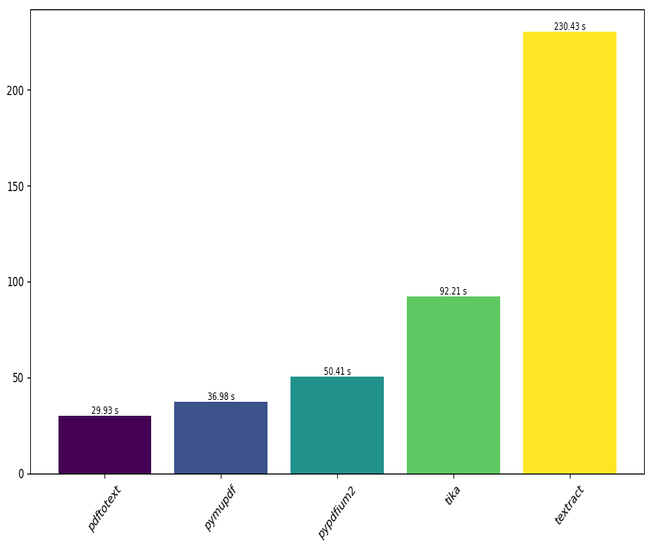
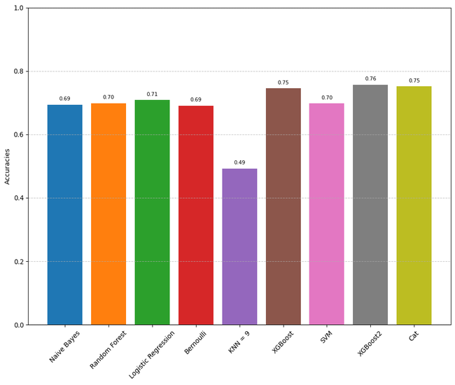
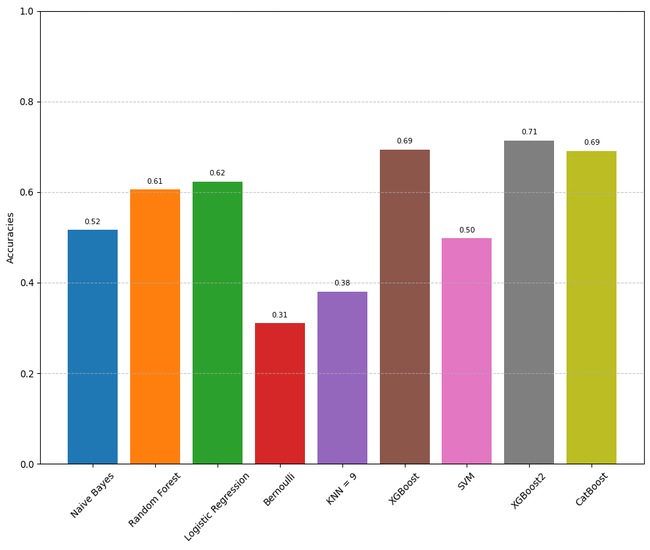
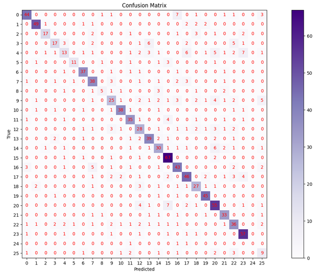
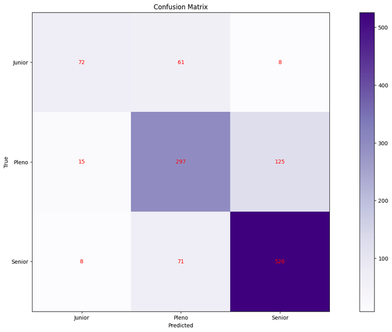

# Curriculum Classifier
## REST API for classifying curricula using machine learning algorithms


The project showcases a rest api that recceives a pdf curriculum and returns the field of ocupation and the level of seniority, along side with the acuracy for each; The machine learning model was trained with 26 areas of ocupation and over 3,000 curricula.

## Getting started
After cloning the repository run:
```sh
pip install < requirements.txt
fastapi dev server.py
```

## Docs
After running the project locally the documentation is available on:

```sh
127.0.0.1:8000/docs
```

## Dataset
This is a custom dataset tailored for this usecase:
https://www.kaggle.com/datasets/danicardeal/resume-occupation-and-seniority

## Benchmarks and algorithms comparison

### PDF Extraction Libraries Benchmark

- **Benchmark: Time** taken to process all PDFs in the dataset.
- **Libraries evaluated**: Tika, PyMuPDF, Textract, Pypdfium2
- **Library chosen**: Pdftotext

### Classification of Seniority and Area of Expertise

#### Seniority Classification
For training the seniority classifier, the text field and the seniority field from the CSV were used.

#### Area of Expertise Classification
For the area of expertise classifier, the class number and text fields were utilized.

## Preprocessing
In the preprocessing phase, the following steps were implemented:

- **Spacy**
  - Stopwords Removal
  - Lemmatization
  - Tokenization
  - Large model used: `en_core_web_lg`

- **Re**
  - Removal of hyperlinks

- **CSV**
  - Mapping of area of expertise classifications to numerical values for training purposes.

- **Models evaluated**:
  - Logistic Regression
  - Support Vector Machine
  - Random Forest
  - k-Nearest Neighbors 
  - Bernoulli Naive Bayes
  - Naive Bayes
  - CatBoost
  - XGBoost

- **Model chosen**: XGBoost with parameters

## Vectorizer and Model Persistence

The data was vectorized using the `CountVectorizer` from sklearn. The trained model was exported and loaded using `joblib` for deployment and inference.

### Accuracies

#### Seniority Accuracy



#### Area of Expertise Accuracy


### Confusion Matrices

#### Confusion Matrix for Area of Expertise


#### Confusion Matrix for Seniority


**Free Software, Hell Yeah!**